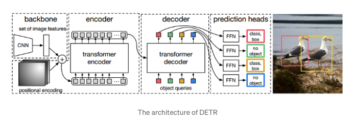

<div align="center">
    <h1>
        EVA 6 (Phase 1) Capstone Part 1<br/>
</div>

### Contributed by [Srikanth Kandarp](https://github.com/silicon-ninja).

### This Document is Submitted as part of EVA 6 Capstone Part 1


## Table of Contents 
- [Table of Contents](#table-of-contents)
- [<center> Overview of the Architecture </center>](#center-overview-of-the-architecture-center)
  - [Achieving Bounding Boxes](#achieving-bounding-boxes)
  - [<center>Yaay! We have achieved the bounding boxes for our image classes</center>](#centeryaay-we-have-achieved-the-bounding-boxes-for-our-image-classescenter)
  - [<center> Now let's look into how we can achive the panoptic segmentation from our bounding box prediction and what is Panoptic segmentation ? you may ask. </center>](#center-now-lets-look-into-how-we-can-achive-the-panoptic-segmentation-from-our-bounding-box-prediction-and-what-is-panoptic-segmentation--you-may-ask-center)
- [<center>Questions to be addressed</center>](#centerquestions-to-be-addressedcenter)
  - [<b>2. We do something here to generate NxMxH/32xW/32 maps. (WHAT DO WE DO HERE?)</b>](#b2-we-do-something-here-to-generate-nxmxh32xw32-maps-what-do-we-do-hereb)
  - [My Solution:](#my-solution)
  - [<b>3. Then we concatenate these maps with Res5 Block (WHERE IS THIS COMING FROM?)</b>](#b3-then-we-concatenate-these-maps-with-res5-block-where-is-this-coming-fromb)
  - [My Solution:](#my-solution-1)
  - [<b>4. Then we perform the above steps (EXPLAIN THESE STEPS) </b>](#b4-then-we-perform-the-above-steps-explain-these-steps-b)
  - [My Solution:](#my-solution-2)
  - [<b>The Pipeline Overview </b>](#bthe-pipeline-overview-b)
- [Referances](#referances)


## <center> Overview of the Architecture </center> 
    
<p align="center">
    
 
    
</p>

The architecture of DETR has three main components, which are a CNN backbone to extract a compact feture representation, encoder-decoder transformer, Feed-Forward Netoworks.
After feature extractions by CNN, 1x1 convolution will reduced the channel dimension of final outputs of CNN. Since transformer is permutation invariant, the fixed positional encoding will be supplement before input transformer encoder.

Transformer decoder is difference with the originals. For N inputs, it decodes N outputs in parallel instead of decodes one element at time. The final predictions will compute by Feed Forward Network(FFN). The FFN predicts the center coordinates(normalized), height and width, and the linear layer predicts the class by softmax function.

The backbone – Features extracted from a Convolutional Neural Network and a positional encoding are passed 
The transformer Encoder – A transformer is naturally a sequence processing unit and for the same reason, we the incoming tensors are flattened. It transforms the sequence into an equally long sequence of features.
The Transformer Decoder – takes in Object queries So its a decoder as a side input for conditioning information. 
Prediction Feed-Forward Network (FFN) – The output for this is going through a classifier which outputs the class labels and bounding box output discussed earlier
Evaluator: 
The evaluation is done on COCO dataset and its primary competitor was the RCNN family that has ruled this category for quiet some time and is considered to be the most classic technique for object detection. 

### Achieving Bounding Boxes 

<b>Step 1: </b>
We put the image through a convolution Neural Network Encoder because CNN works best with images. So after passing through CNN the image features are conserved. This is the higher-order representation of an image with many more feature channels. 

<b>Step 2: </b>
This enriched feature map of the image is given to a transformer encoder-decoder, which outputs the set of box prediction. Each of these boxes is consisting of a tuple. The tuple will be a class and a bounding box. Note: this also includes the class NULL or Nothing class and its position as well.
Now, this is a real problem as in the annotation there is no object class annotated as nothing. Comparing and dealing with similar objects next to each other is another major issue and in this paper, it is tackled by using bipartite matching loss. The loss is compared by comparing each class and bounding box there is with its corresponding class and box including the none class, which are let’s say N, with the annotation including the part added that contains nothing to make the total boxes N. The assignment of the predicted to the actual is a one to one assignment such that the total loss is minimized. There is a very famous algorithm called the Hungarian method to compute these minimum matching. 

### <center>Yaay! We have achieved the bounding boxes for our image classes</center> 

<p align="center">
    
  
    
</p>


### <center> Now let's look into how we can achive the panoptic segmentation from our bounding box prediction and what is Panoptic segmentation ? you may ask. </center>

Panoptic segmentation task it is a fusion of instance segmentation which aims at predicting a mass for each distinct instant of a foreground object and segmenting segmentation which aims at predicting a class label for each pixel in the background the resulting task requires that each pixel belongs to exactly one segment through panoptic segmentation we aim at understanding whether detour's object embeddings can be used for other downstream tasks to approach this task we first train dito to predict boxes around both foreground and background objects in a uniform manner by contrast existing methods tend to treat both kind of entities differently

To DETR panoptic segmentation has 4 parts:

1. We train DETR to predict boxes around both ```stuff``` and ```things``` classes on COCO, using the same recipe. (Hungarian matching is computed using distance between boxes, so predicting boexs is required for the training to be possible)
    
2. A mask head predicts a binary mask for each of the predicted boxes. It takes as input the output of the transformer decoder for each object computes mutli-head(with M heads) attention scores of this embedding over the output of the encoder, generating M attention heatmaps per object in a small resolution.
    
3. An FPN-like architecture is used to make the final prediction and increase the resolution. The final resolution of the masks has stride 4 and each mask is supervised independently using the DICE/F-1 loss and Focal loss.
    
4. We predict the final panoptic segmentation we simply use an argmax over the mask scores at each pixel, and assign the corresponding categories to the resulting masks.

    
    
## <center>Questions to be addressed</center> 


<b> 1. We take the encoded image (dxH/32xW/32) and send it to Multi-Head Attention (FROM WHERE DO WE TAKE THIS ENCODED IMAGE?)</b>

 My Solution:

After we predit the bounding boxes from the detr with encoder and decoder 

### <b>2. We do something here to generate NxMxH/32xW/32 maps. (WHAT DO WE DO HERE?)</b>

### My Solution:


### <b>3. Then we concatenate these maps with Res5 Block (WHERE IS THIS COMING FROM?)</b>

### My Solution: 


### <b>4. Then we perform the above steps (EXPLAIN THESE STEPS) </b>

### My Solution: 


### <b>The Pipeline Overview </b>


## Referances 

