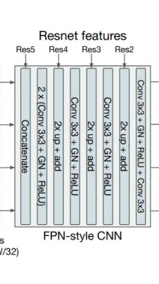
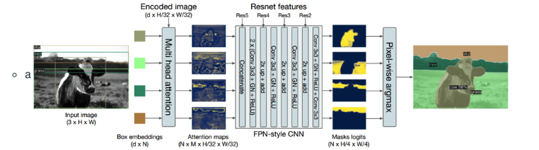

<div align="center">
    <h1>
        EVA 6 (Phase 1) Capstone Part 1<br/>
</div>

### Submitted by [Srikanth Kandarp](https://github.com/silicon-ninja).

### This Document is Submitted as part of EVA 6 Capstone Part 1


## Table of Contents 

- [<center> Overview of the Architecture </center>](#-center--overview-of-the-architecture---center-)
- [<center>Questions to be addressed :) </center>](#-center-questions-to-be-addressed------center-)
- [Referances](#referances)

## <center> Overview of the Architecture </center> 
    
<p align="center">
    
 
    
</p>

The architecture of DETR has three main components, which are a CNN backbone to extract a compact feture representation, encoder-decoder transformer, Feed-Forward Netoworks.
After feature extractions by CNN, 1x1 convolution will reduced the channel dimension of final outputs of CNN. Since transformer is permutation invariant, the fixed positional encoding will be supplement before input transformer encoder.

Transformer decoder is difference with the originals. For N inputs, it decodes N outputs in parallel instead of decodes one element at time. The final predictions will compute by Feed Forward Network(FFN). The FFN predicts the center coordinates(normalized), height and width, and the linear layer predicts the class by softmax function.

The backbone – Features extracted from a Convolutional Neural Network and a positional encoding are passed 
The transformer Encoder – A transformer is naturally a sequence processing unit and for the same reason, we the incoming tensors are flattened. It transforms the sequence into an equally long sequence of features.
The Transformer Decoder – takes in Object queries So its a decoder as a side input for conditioning information. 
Prediction Feed-Forward Network (FFN) – The output for this is going through a classifier which outputs the class labels and bounding box output discussed earlier
Evaluator: 
The evaluation is done on COCO dataset and its primary competitor was the RCNN family that has ruled this category for quiet some time and is considered to be the most classic technique for object detection. 

### Achieving Bounding Boxes 

<b>Step 1: </b>
We put the image through a convolution Neural Network Encoder because CNN works best with images. So after passing through CNN the image features are conserved. This is the higher-order representation of an image with many more feature channels. 

<b>Step 2: </b>
This enriched feature map of the image is given to a transformer encoder-decoder, which outputs the set of box prediction. Each of these boxes is consisting of a tuple. The tuple will be a class and a bounding box. Note: this also includes the class NULL or Nothing class and its position as well.
Now, this is a real problem as in the annotation there is no object class annotated as nothing. Comparing and dealing with similar objects next to each other is another major issue and in this paper, it is tackled by using bipartite matching loss. The loss is compared by comparing each class and bounding box there is with its corresponding class and box including the none class, which are let’s say N, with the annotation including the part added that contains nothing to make the total boxes N. The assignment of the predicted to the actual is a one to one assignment such that the total loss is minimized. There is a very famous algorithm called the Hungarian method to compute these minimum matching. 

### <center>Yaay! We have achieved the bounding boxes for our image classes</center> 

<p align="center">
    
  
    
</p>


### <center> Now let's look into how we can achive the panoptic segmentation from our bounding box prediction and now what is this Panoptic segmentation ? you may ask ? aren't we done ? Answer: <b>NO.</b> </center>

Panoptic segmentation task it is a fusion of instance segmentation which aims at predicting a mass for each distinct instant of a foreground object and segmenting segmentation which aims at predicting a class label for each pixel in the background the resulting task requires that each pixel belongs to exactly one segment through panoptic segmentation we aim at understanding whether detour's object embeddings can be used for other downstream tasks to approach this task we first train dito to predict boxes around both foreground and background objects in a uniform manner by contrast existing methods tend to treat both kind of entities differently

To DETR panoptic segmentation has 4 parts:

1. We train DETR to predict boxes around both ```stuff``` and ```things``` classes on COCO, using the same recipe. (Hungarian matching is computed using distance between boxes, so predicting boexs is required for the training to be possible)
    
2. A mask head predicts a binary mask for each of the predicted boxes. It takes as input the output of the transformer decoder for each object computes mutli-head(with M heads) attention scores of this embedding over the output of the encoder, generating M attention heatmaps per object in a small resolution.
    
3. An FPN-like architecture is used to make the final prediction and increase the resolution. The final resolution of the masks has stride 4 and each mask is supervised independently using the DICE/F-1 loss and Focal loss.
    
4. We predict the final panoptic segmentation we simply use an argmax over the mask scores at each pixel, and assign the corresponding categories to the resulting masks.

    
    
## <center>Questions to be addressed :) </center> 


<b> 1. We take the encoded image (dxH/32xW/32) and send it to Multi-Head Attention (FROM WHERE DO WE TAKE THIS ENCODED IMAGE?)</b>

My Solution:

After we have trained our model we are left out with the bounding boxes predictions and then we take that box embeddings which are ```(d x N) where d is Dimensions and N is No of Predictions ``` and later we pass those embeddings through the multi head attention layer where the encoded image is coming as 1-Dimensional image and we are converting that into a 2-Dimensional image where we use a multi-head attention layer that returns the attention scores over the encoded image for each object embedding. Here the encoded image is ```(dxH/32xW/32) where d is Dimensions and H is the Height of the Image and W is the Width of the Image```.

<b>2. We do something here to generate NxMxH/32xW/32 maps. (WHAT DO WE DO HERE?)</b>

My Solution:

So when we pass the encoded 2-Dimensional image where we up sample and clean these masks using a convolutional network that uses the intermediate activations from the backbone as a result we get high resolution maps which are ```Attention Maps``` and this Attention Maps become the input to the FPN-Style CNN which we achived while we were encoding the images from the encoder when we first feed the image to the cnn and we set aside the activations from the intermediate layers after the encoding.

<b>3. Then we concatenate these maps with Res5 Block (WHERE IS THIS COMING FROM?)</b>

My Solution:

After we pass the Attention maps to ```Reverse ResNet``` to mask it and then clean it using the activations from the intermediate layers from the encoder that we got it from  and we would be using ```Res5 Block and Others``` for upsampling the ```Attention Maps Channel ``` where 
```(N x M x H/32 x W/32)```
 where N is the no of channel maps and M is coming from the Multi-Head Attention with H being the height of the image and W being the width of the image.

    
<p align="center">
    
 
    
</p>

as we know that the ```Res5 Block``` is coming from the 
intermediate layers from the encoder and then 2 convolution layers with ```conv 3 x 3 with Group Normalization and ReLU``` and is forward to ```Res4 Block``` where we upscale the image and again do convolution then we repeat this steps until ```Res2 Block``` and finally for one last time we do convolution with ``` conv 3 x 3 with Group Normalization and ReLU and conv 3 x 3 at the end```. After we do the ```Reverse ResNet``` we get the ```Masks Logits``` which are high resolution maps where each pixel contains a binary logic of belonging to the mask finally we merge the masks by assigning each pixel to the mask with the highest logit using a simple pixel-wise rmx which is four times smaller then our original image and we make it zero and we overlay it on the top then our image and we would end up with the segmentation.


<b>4. Then we perform the above steps (EXPLAIN THESE STEPS) </b>

My Solution:
### <b>The Pipeline Overview </b>

<p align="center">
    
 
    
</p>
Here is an overview of the panoptic architecture we first feed the image to the cnn and we set aside the activations from the intermediate layers after the encoder we also set aside the encoded version of the image and then proceed to the decoder we end up with one object embedding for the foreground cow and one objector meading for each segment of the background namely the sky grass and trees we then use a multi-head attention layer that returns the attention scores over the encoded image for each object embedding we proceed to upsample and clean these masks using a convolutional network that uses the intermediate activations from the backbone as a result we get high resolution maps where each pixel contains a binary logic of belonging to the mask finally we merge the masks by assigning each pixel to the mask with the highest logit using a simple pixel-wise rmx and finally we end up with the segmentation with things being our object and stuff being the things like sky and grass.

---
## Referances 

1. https://arxiv.org/pdf/2005.12872.pdf
2. https://www.youtube.com/watch?v=BNx-wno-0-g
3. https://www.youtube.com/watch?v=utxbUlo9CyY
4. https://ai.facebook.com/blog/end-to-end-object-detection-with-transformers/
5. https://www.kaggle.com/tanulsingh077/end-to-end-object-detection-with-transformers-detr
